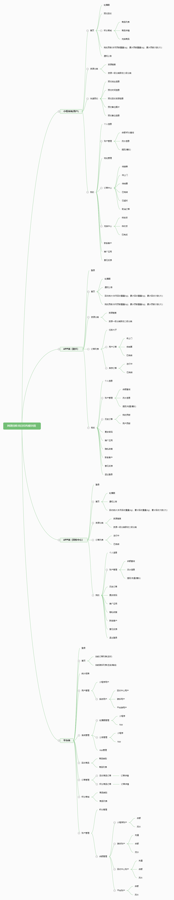

## 项目设计
<!--  -->

### 项目设计

#### 1、项目主线流程

1. 用户通过小程序端发起订单、骑手通过APP推送功能进行接单、骑手接单之后赶到用户下单地址（用户需要先确定骑手是否到达）确定之后，骑手开始验收货物，验收完成之后按照用户价格向用户支付费用（流程结束）。
2. 骑手可以将货物暂时保存自行处理也可以将货物送往回收中心，回收中心验收完货物之后按骑手价格向骑手支付费用（流程结束）。
3. 小程序用户下单流程结束之后，会获得该笔订单的赠送积分，小程序用户可以在积分商城进行下单，下单之后平台端（集团人员）会将商品寄送到用户下单地址（流程结束）。

#### 2、项目主要功能设计

1. 关于支付流程模块设计（未接入三方支付，仅仅做了模拟），项目采用扫码支付方式。

   + 账户设计
     + 平台端默认充值：1000000元。
     + 骑手、回收中心注册账号之后，系统默认充值(骑手1000，回收中心5000元)用于支出费用，同时平台每个月也会扣取部分费用(骑手)。

   + 骑手和用户 交易流程 设计
     + 骑手计算完商品费用之后，用户点击订单结算按钮生成收款码，骑手通过扫码进行付款(用户账户进账，骑手账户出帐)，流程完完成之后，自动改变该条订单状态。
   + 骑手和回收中心 交易流程 设计
     + 和骑手与用户交易流程相似，也通过扫码进行处理。

2. 关于账户流水/积分流水模块设计

   + 平台端可以给回收中心和骑手账户进行充值，可以查看各端的账户流水和积分流水（小程序）。
   + 骑手和回收中心用户可以在APP端查看账户流水（及模拟充值）。
   + 小程序用户可以查看账户流水和积分流水（账户模拟提现）。

3. 平台端主要负责整个项目的运行管理，例如：通知公告/轮播图管理、小程序用户数量统计、订单模块管理、回收商品管理、账户管理、用户/骑手信息管理、系统意见和反馈、综合报表等等。

### 项目模块功能

#### 1、用户（小程序）

```tex
小程序端(用户)
	首页
		轮播图
		预约回收
		积分商城（待开发）
			商品列表
			商品详情
			兑换商品
		我的贡献(本月贡献重量(kg)、累计贡献重量(kg)、累计贡献次数(次)）
		通知公告
	资源分类
		资源搜索
		资源一级分类联动二级分类
	快速预约
		预约地址信息
		预约时间信息
		预约回收资源信息
		预约备注图片
		预约备注信息
	我的
		个人信息
		账户管理
			余额/积分查询
			流水信息
			提现(模拟)
		地址管理
		订单中心
			待接单
			待上门
			待结算
			已完结
			已超时
			取消订单
		兑换中心（待开发）
			待发货
			待收货
			已完成
		联系客户
		推广应用（待开发）
		意见反馈
```


#### 2、骑手（APP）

```tex
APP端（骑手）
	登录
	首页
		轮播图
		通知公告
		回收统计(本月回收重量(kg)、累计回收重量(kg)、累计回收次数(次)）
		我的贡献(本月贡献重量(kg)、累计贡献重量(kg)、累计贡献次数(次)）
	资源分类
		资源搜索
		资源一级分类联动二级分类
	订单列表
		任务大厅
		用户订单
			待上门
			待结算
			已完结
		库存订单
			进行中
			已完结
	我的
		个人信息
		账户管理
			余额查询
			流水信息
			提现/充值(模拟)
		历史订单
			我的贡献
			用户贡献
		更改密码
		推广应用
		隐私政策
		联系客户
		意见反馈
		退出登录

```


#### 3、回收中心（APP）

```tex
APP端（回收中心）
	登录
	首页
		轮播图
		通知公告
		回收统计(本月回收重量(kg)、累计回收重量(kg)、累计回收次数(次)）
	资源分类
		资源搜索
		资源一级分类联动二级分类
	订单列表
		进行中
		已完结
	我的
		个人信息
		账户管理
			余额查询
			流水信息
			提现/充值(模拟)
		历史订单
		更改密码
		推广应用
		隐私政策
		联系客户
		意见反馈
		退出登录

```


#### 4、集团人员（PC端）

```tex
平台端
	登录
	首页
		当前订单列表(实时)
		当前骑手列表(在线/离线)
	统计报表
	用户管理
		小程序用户
		系统用户
			回收中心用户
			骑手用户
			平台端用户
	系统管理
		轮播图管理
			小程序
			App
		公告管理
			小程序
			App
		App管理
	回收商品
		商品类别
		商品列表
	订单管理
		回收商品订单
			订单详情
		积分商品订单
			订单详情
	积分商城
		商品类别
		商品列表
	账户管理
		积分管理
		余额管理
			小程序账户
				余额
				流水
			骑手账户
				充值
				余额
				流水
			回收中心账户
				充值
				余额
				流水
			平台账户
				余额
				流水
```

